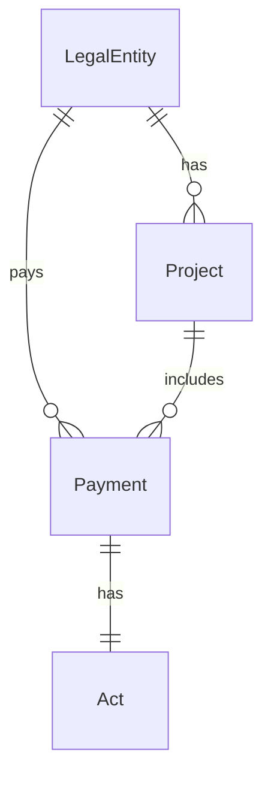

# Архитектура

## Сущности

| Сущность | Назначение |
|----------|------------|
| `LegalEntity` | Клиент / плательщик (ИНН, ОГРН, реквизиты) |
| `Project` | Направление работ (в моках 1:1 с юрлицом) |
| `Payment` | Поступление денег по этапу/услуге |
| `Act` | Закрывающий документ (1:1 с оплатой) |

Статус акта **не хранится** в БД — вычисляется в `ActStatusService`.

## Бизнес-логика

Расположение: `backend/app/Services/`

- `ActStatusService` — статусы актов, правила обновления
- `PaymentFilterService` — единые фильтры для API
- `DashboardSummaryService` — KPI и агрегаты по проектам
- `BankStatementImportService` — stub пайплайна импорта из PDF

### Статусы актов

| Условие | Статус |
|---------|--------|
| отправлен + подписан | `closed` (Закрыт) |
| отправлен, не подписан | `awaiting_signature` |
| оплата старше 14 дней и не закрыта | `needs_attention` |
| иначе | `not_sent` |

Референсная дата для демо: `DASHBOARD_REFERENCE_DATE=2026-08-14` (конец периода выписки).

При `is_signed=true` автоматически ставится `is_sent=true`.

## Слои

| Слой | Где |
|------|-----|
| Данные | Eloquent models, migrations, seed |
| Бизнес-логика | `app/Services` |
| API | `app/Http/Controllers/Api`, Form Requests, Resources |
| UI | `frontend/src` (Vue, Pinia, components) |

## Импорт из PDF (заготовка)

1. Парсинг PDF → сырые операции
2. `BankStatementImportService::filterProjectIncomingPayments()` — только входящие от клиентов
3. Исключение по ключевым словам (НДФЛ, зарплата, депозит, комиссия, аренда)
4. `detectServiceStage()` — этап из назначения платежа
5. Создание `LegalEntity` / `Project` / `Payment` / `Act`

В прототипе seed загружается из готового JSON (результат ручной оцифровки HTML/PDF).

## Допущения

1. В мок-данных один проект на одно юрлицо
2. Все seed-оплаты подтверждены (`is_confirmed=true`)
3. Этапы в seed уже размечены; при импорте PDF — эвристика
4. Порог «требует внимания» — 14 календарных дней от даты оплаты до reference date
5. Период UI: 16.07.2026–09.08.2026 (отфильтрованные проектные оплаты)

## Деплой

Один контейнер: `docker compose up --build`. Laravel отдаёт API и SPA из `public/spa/`.

Для production на Render/Railway: тот же Dockerfile, переменные `APP_KEY`, `DASHBOARD_REFERENCE_DATE`.
